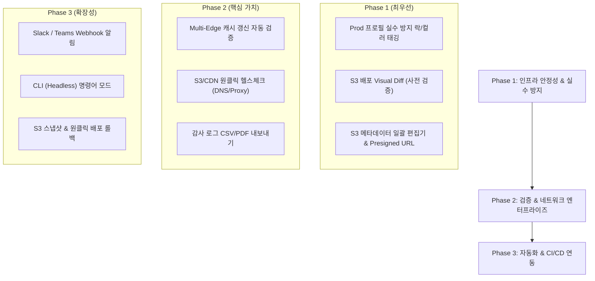

# NexusPurge 인프라팀 관점 부가기능 제안서 (INFRA_FEATURE_IDEAS)

> **목적**: 본 문서는 시중의 주요 S3/CDN 관리 도구(Cyberduck, Rclone, AWS S3 Browser, Akamai Control Center, Cloudflare 등)를 벤치마킹하고, **고객사 인프라팀(Cloud Infra Engineer, DevOps, CDN/Storage 운영자)**의 실제 운영 환경과 페인 포인트(Pain Point)를 반영한 부가기능 아이디어를 세밀하게 리스트업한 제안서입니다.

---

## 🎯 타겟 페르소나 및 운영 환경 분석

- **주요 사용자**: 고객사 클라우드 인프라팀, DevOps 엔지니어, 서비스 운영/배포 담당자
- **운영 환경 특징**:
  - Dev, Staging, QA, Production 등 **다중 환경(Multi-Environment)** 및 복수의 AWS 계정/S3 버킷 관리
  - 2개 이상의 멀티 CDN(CloudFront + Akamai/KT/LG U+/효성ITX) 병행 운용
  - 사내 보안 망(Proxy, 폐쇄망, VPN) 내 작업 및 ISMS-P / ISO27001 등 보안 감사 규정 준수 필요
  - 정적 웹 자산, 게임 패치, 미디어 파일 배포 시 장애(잘못된 Purge 또는 잘못된 파일 덮어쓰기) 방지가 최우선 과제

---

## 📊 시중 도구 벤치마킹 및 시사점

| 벤치마킹 도구 | 주요 장점 | NexusPurge 도입 시 착안점 |
|---|---|---|
| **Cyberduck / Transmit** | 직관적 듀얼 패널, S3 메타데이터/Presigned URL 관리 | 인프라팀을 위한 우클릭 S3 메타데이터 일괄 변경 및 임시 공유 링크 UI 필요 |
| **Rclone / AWS CLI** | Dry-run(사전 검증), 고속 스마트 동기화, 대역폭 제한 | 배포 전 변경사항 Visual Diff(사전 검증) 및 대역폭 제한 기능 도입 필요 |
| **Akamai / Cloudflare Console** | Purge 전파 상태 조회, 엣지 캐시 히트율, Rate Limit 제어 | Purge 직후 글로벌 엣지 노드 응답 자동 검증(Multi-Edge Inspection) 필요 |
| **Datadog / CloudWatch** | 이력 추적, 감사 로그, 외부 Webhook 알림 연동 | "누가/언제/어디에 Purge했는지" 감사 리포트 내보내기 및 Slack/Teams 알림 필요 |

---

## 🚀 인프라팀 관점 부가기능 리스트업 (6대 영역)

### 1. 멀티 환경(Dev/Stg/Prd) 안전 관리 및 보안 가버넌스

인프라팀은 실수 하나로 실서버(Prod) 서비스 장애가 발생하는 것을 가장 두려워합니다. 환경 식별과 작업 안전장치가 필수적입니다.

| 부가기능 아이디어 | 인프라팀 활용 시 가치 및 상세 설명 |
|---|---|
| **🛡️ 환경별 컬러 태깅 & 실수 방지 안전 락 (Safety Tag & Lock)** | - 프로필별로 **Prod(빨강), Staging(주황), Dev(초록)** 식별 컬러 배지를 부여하여 작업자가 현재 접속한 환경을 명확히 인지. - Production 프로필에서 전체 Purge, 폴더 삭제, 대량 덮어쓰기 시 **2차 PIN 번호 입력** 또는 **"PROD-PURGE" 텍스트 입력 승인창** 강제. |
| **🔑 프로필 팀 공유 및 암호화 임포트/에스크로** | - 신규 팀원 합류 시 AWS AccessKey를 직접 공유하지 않고, 시크릿이 보호된 안전한 `.nexprofile` 파일로 권한(Can-Purge/Read-Only 등)을 포함해 원클릭 임포트. - Keyring 연동으로 개인 PC 내 평문 자격증명 유출 방지. |
| **🏷️ 작업 사유 필수 입력 유도 (Audit Reason Tagging)** | - Purge 또는 배포 실행 시 **"Jira 티켓 번호"** 또는 **"작업 사유"**(예: `[INC-1024] 폰트 캐시 무효화`)를 입력하도록 하여 변경 이력 관리 강화. |

---

### 2. CDN Purge 엣지 검증, 쿼터 모니터링 & 감사(Audit) 리포트

Purge 버튼을 누른 후 "진짜로 CDN 엣지 서버 전체에 반영되었는지" 및 "비용/쿼터 초과는 없는지" 확인하는 기능입니다.

| 부가기능 아이디어 | 인프라팀 활용 시 가치 및 상세 설명 |
|---|---|
| **🌐 Multi-Edge 캐시 갱신 자동 검증 리포트 (Edge Verification)** | - Purge 완료 N초 후 서울, 도쿄, 미주 등 주요 CDN 엣지 IP로 HTTP HEAD/GET 요청을 자동 전송. - `X-Cache: MISS`, `ETag`, `Age` 헤더를 다원 수집하여 **"글로벌 엣지 전파 완료율 100%"** 시각적 상태표 표시. |
| **📜 ISMS-P/보안 감사용 Purge & 전송 이력 리포트 내보내기** | - 보안 감사 및 인프라 이력 제출용으로 **CSV / PDF / JSON 형태의 감사 보고서** 내보내기. - 항목: 작업 시각, IAM 프로필 ID, S3 버킷/경로, 대상 CDN Provider, Purge 상태, 소요 시간, 입력된 작업 사유. |
| **💰 CDN 쿼터 & 비용 가드 (Quota & Cost Guard)** | - CloudFront 월 1,000건 무료 invalidations, Akamai API Rate Limit 등 **무료 쿼터 초과 시 예상 추가 과금 비용($0.005/path) 경고** 안내. - 짧은 시간 내 중복 Purge 요청 발생 시 멱등성을 보장하여 API 호출 비용 및 쿼터 낭비 차단. |

---

### 3. 배포 안전성 & 원클릭 스냅샷 롤백 (Release & Rollback)

정적 웹 자산이나 게임 패치 배포 중 오류가 발생했을 때 인프라팀이 즉시 이전 상태로 복구할 수 있는 기능입니다.

| 부가기능 아이디어 | 인프라팀 활용 시 가치 및 상세 설명 |
|---|---|
| **🔄 S3 배포 스냅샷 & 원클릭 롤백 (Snapshot & Rollback)** | - 업로드/배포 시작 직전, 현재 S3 버킷/프리픽스 내 객체 상태 스냅샷(버전 ID 리스트)을 자동 저장. - 배포 후 화면 깨짐 등 장애 발생 시 **"원클릭 롤백" 버튼으로 S3 버전을 배포 이전으로 순식간에 복원하고 CDN 자동 Re-Purge 트리거**. |
| **🔍 배포 전 시각적 변경사항 검증 (Visual Diff & Dry-Run)** | - 실제 파일이 S3에 덮어씌워지기 전, **Local vs Remote 파일 목록 비교 다이얼로그(Diff View)** 제공. - 신규 추가, 수정, 삭제될 파일 개수와 전체 용량 변화를 사전에 눈으로 검증하여 잘못된 경로 업로드 사전에 차단. |

---

### 4. 엔터프라이즈 사내 보안망 & 진단 툴킷 (Network & Enterprise)

고객사 사내 보안망(프록시, 폐쇄망) 및 신규 CDN 도입 시 발생하는 네트워크 문제를 1초 만에 진단하는 기능입니다.

| 부가기능 아이디어 | 인프라팀 활용 시 가치 및 상세 설명 |
|---|---|
| **🔒 사내 HTTP/HTTPS 프록시 (Proxy) & PAC 지원** | - 사내 보안망 및 DMZ 환경에서 외부 AWS S3 및 CDN OpenAPI 호출 시 필요한 `HTTP_PROXY`, `HTTPS_PROXY`, 사내 인증 프록시 서버 설정 지원. |
| **🩺 S3/CDN 인프라 원클릭 헬스체크 (Network Diagnostics)** | - S3 엔드포인트 연결성(Ping/Latency), DNS CNAME 정상 등록 여부(NXDOMAIN 감지), CDN SSL 인증서 만료 D-Day를 원클릭 진단. - (예: 효성ITX/KT CDN 사용 시 고객사 DNS 미등록 문제 발생 직후 **"DNS CNAME 미등록 장애"**로 정확한 원인 즉시 리포팅). |
| **🌐 Local Host Override (DNS 미등록 전 사전 테스트)** | - 신규 CDN 도메인을 공식 public DNS에 등록하기 전, 앱 내부적으로 테스트 IP를 지정하여 **CDN 엣지 서버 응답을 사전에 미리 검증**. |

---

### 5. CI/CD 파이프라인 연동 & 알림 (Automation & Integrations)

데스크톱 앱을 넘어 인프라팀의 기존 자동화 도구(Jenkins, GitHub Actions, Slack 등)와 연동하는 기능입니다.

| 부가기능 아이디어 | 인프라팀 활용 시 가치 및 상세 설명 |
|---|---|
| **💬 Slack / MS Teams Webhook 알림 연동** | - 대용량 스마트 동기화 완료, 배포 롤백, CDN Purge 성공/실패 이벤트를 설정된 사내 **Slack/Teams 채널로 Webhook 카드 메시지 실시간 전송**. |
| **💻 CLI / Headless Executable 모드 (`nexus-cli`)** | - GUI 조작 외에 CI/CD 파이프라인(Jenkins, GitHub Actions 등)에서 빌드 후 자동 Purge를 호출할 수 있도록 **헤더리스 CLI 명령어 모드 제공** (`nexus-cli purge --profile prod --path "/assets/*"`). |

---

### 6. S3 자산 최적화 & 운영 편의성 (S3 Ops & Productivity)

매일 관리하는 S3 자산의 성능을 최적화하고 운영 피로도를 낮추는 기능입니다.

| 부가기능 아이디어 | 인프라팀 활용 시 가치 및 상세 설명 |
|---|---|
| **🏷️ S3 메타데이터 & HTTP 헤더 일괄 편집기 (Batch Header Editor)** | - 이미 S3에 저장되어 있는 수천 개 객체의 `Cache-Control`, `Content-Type`, `Content-Encoding` (gzip/br) 헤더를 **재업로드 없이 선택 일괄 변경**. |
| **🔗 S3 Presigned URL (임시 다운로드 링크) 원클릭 UI 생성** | - 1시간/24시간 유효한 보안 임시 다운로드 URL을 우클릭 메뉴에서 즉시 생성하여 클립보드 복사 (사내 타 부서 공유 시 S3 권한 오픈 없이 안전 전달). |
| **📌 S3 깊은 경로 즐겨찾기 (Bookmarked Path Bar)** | - 5단계 이상 깊은 S3 구조(`/company/service/v2/static/assets`)를 즐겨찾기로 등록하여 원클릭 빠른 경로 이동. |
| **⏯️ 전송 큐 속도 제한 (Speed Limiter) 및 개별 일시정지** | - 대용량 전송 시 사내 네트워크 대역폭을 독점하지 않도록 최대 업로드/다운로드 속도(MB/s) 제한 및 큐 개별 일시정지/재개. |

---

## 📌 우선순위 로드맵 제안 (인프라팀 관점)

---

> **결론**: 고객사 인프라팀 입장에서 NexusPurge는 단순한 "S3 파일 올리고 CDN 째는 툴"을 넘어, **"실수를 완벽히 예방하고, Purge 결과를 증적하며, 장애 시 원클릭 롤백이 가능한 인프라 운용 콕핏(Cockpit)"**으로 발전할 때 가장 큰 매력을 느끼게 됩니다.
